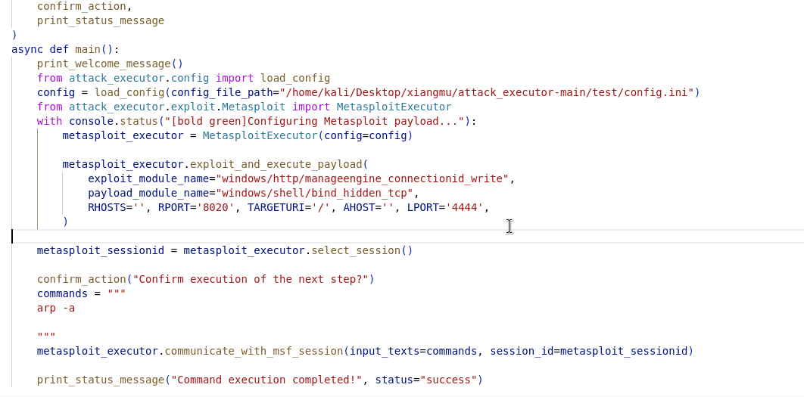

## Pull and deploy the attack range: 
After successfully generating the yml file of the attack chain, you can use pull.py to automatically read the files within it to automatically pull and deploy the virtual machine range. 

Note that automatic deployment is applicable to VirtualBox. Of course, if you are using Vmware, you can also manually deploy it yourself based on the downloaded files.

There are two modes for download deployment: prohibiting duplicate deployment and allowing duplicate downloads. 

When repeated downloading is not allowed, if the storage path has already downloaded a file, it will ask whether it is necessary to start directly.

When repeated downloads are allowed, the downloaded file will be automatically renamed for deployment to prevent conflicts.

Note that during the initial deployment (including the case of duplicate deployment), considering that users may need to modify the configuration, the virtual machine will not start automatically.

Network configuration: The downloaded virtual machine will automatically configure two network cards. One selects the NAT mode and the other selects the Host-only mode. 
This mode requires users to consider their own configuration for adjustment. If the VirtualBox itself does not configure the corresponding network card, the problem of failure to start will occur.

```bash
## Prohibiting duplicate deployment
python pull.py -p #yml_file_path -d #storage_path -vm #VBoxManage.exe_path --url_table #url_table_path -nr
## Allowing duplicate downloads
python pull.py -p #yml_file_path -d #storage_path -vm #VBoxManage.exe_path --url_table #url_table_path -r
```
## Generation of attack scripts: 
The logic of the script is to configure itself based on the parameters provided in the `attack_plan.yml`. The script reads commands and parameters by determining the type of executor specified. Additionally, it explicitly extracts arguments marked as `Required: true` from the `exploit` and `payload` sections of the file and outputs them directly into the executable script. This design simplifies user configuration and minimizes manual intervention. After executing this script, users will obtain a large number of ready-to-run attack scripts, streamlining the setup process and saving operational time

```bash
python generateExecution.py
```

 <p align="center">
 
 </p>
 
## Execution of attack script: 


```bash
python ../results/execution_xxxx.py
```
Just configure a few parameters to run the attack script.

Click the following headings for details:
<details>
<summary>EXAMPLE-execution_arp_cache_info_printed-1</summary>

The attack plan demonstrates a multi-stage adversarial strategy targeting `ManageEngine Desktop Central 9` via the `CVE-2015-8249` vulnerability, leveraging `Metasploit` and `ART` frameworks to achieve remote code execution (RCE), establish persistent command and control (C2), and conduct network reconnaissance(arp -a).




</details>
