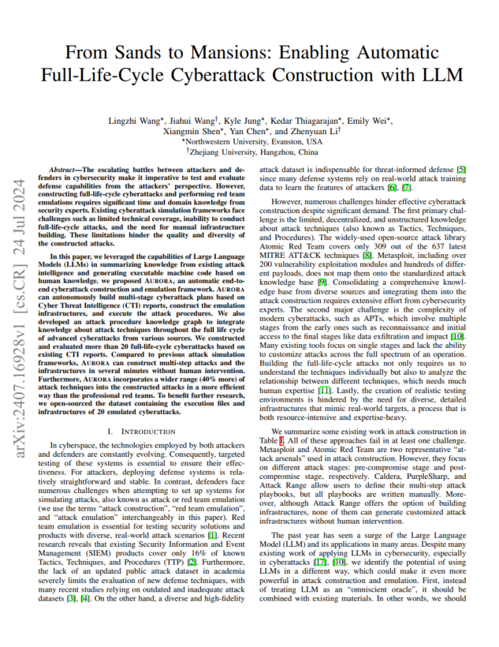

# Aurora-demos: 
This projects contains the attack chains generated by Aurora, an semi-automated cyber attack construction framework.

Aurora is a framework that can construct multi-step cyberattacks (attack chains).
With the help of LLM, it makes use of external attack tools and threat intelligence reports.

We are preparing publishing the source code of Aurora.

## 🎉 Introduction

- Introduces AURORA, a PDDL-based cyberattack simulation system.
- Integrates LLMs into PDDL for real-world BAS.
- Automates construction of a 1,800+ action attack space with over 300 chains.
- AURORA generates higher quality attack plans with broader TTP coverage.

Our paper: [From Sands to Mansions: Simulating Full Attack Chain with LLM-Organized Knowledge](https://arxiv.org/pdf/2407.16928)

## Resources & Socials
* 📜 [Documentation, training, and use-cases]()(Comming Soon)
* ✍️ [aurora's blog]()(Comming Soon)
* 🌐 [Homepage](https://auroraattack.github.io/)

## Attack Demos
This repo stores attack demos generated by Aurora, which can be found in the examples/ folder.
Each folder in example 

## System Overview

  

## Licensing

To discuss licensing opportunities, please reach out to aurora@[] or directly to .