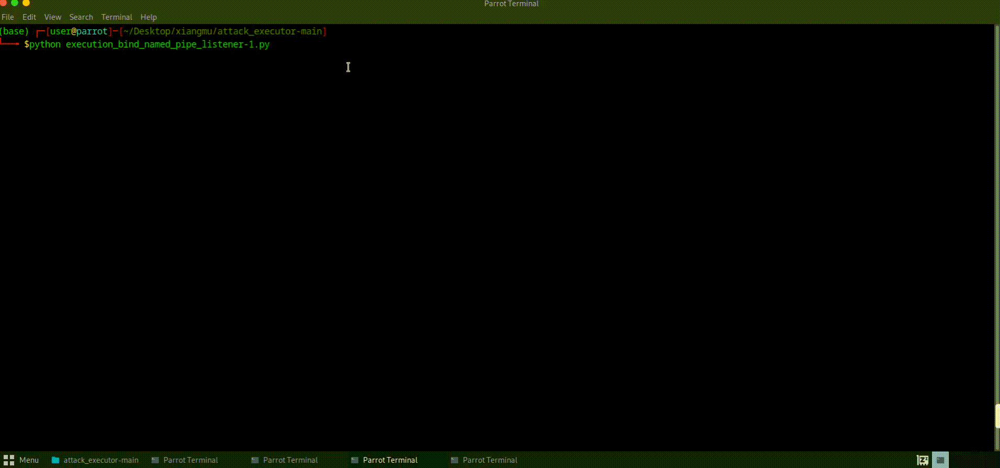

<!-- [](https:%5B%5D) -->


# Aurora-demos: Automated Cyberattack Emulation

This project contains the attack chains generated by Aurora, a cyberattack emulation system leveraging classical planning (PDDL) and Large Language Models (LLMs).

Aurora is a framework that can automatically construct multi-step cyberattacks (attack chains), set up emulation environments, and semi-automatically execute the generated attack chains.
Using LLM capabilities, it leverages external attack tools and threat intelligence reports.

We are preparing publishing the source code of Aurora.

If you use the attack chains in this repo, please cite our paper. Thanks! ☺️
```
@article{wang2024sands,
  title={From Sands to Mansions: Towards Automated Cyberattack Emulation with Classical Planning and Large Language Models},
  author={Wang, Lingzhi and Li, Zhenyuan and Jiang, Yi and Wang, Zhengkai and Guo, Zonghan and Wang, Jiahui and Wei, Yangyang and Shen, Xiangmin and Ruan, Wei and Chen, Yan},
  journal={arXiv preprint arXiv:2407.16928},
  year={2024},
  archivePrefix={arXiv},
  url={https://arxiv.org/abs/2407.16928}
}
```

## 🎉 Introduction

<p><a href="https://arxiv.org/pdf/2407.16928"></a></p>

-   Introduces AURORA, a cyberattack emulation system that leverages classical planning (PDDL) and Large Language Models (LLMs).
-   Constructs an extensive attack space containing over 5,000 attack actions and 1,000 attack chains.
-   Generates high-quality attack plans with comprehensive TTP (Tactics, Techniques, and Procedures) coverage.
-   Automatically sets up the attack emulation environments and semi-automatically executes the attacks.

Our paper: [From Sands to Mansions: Towards Automated Cyberattack Emulation with Classical Planning and Large Language Models](https://arxiv.org/pdf/2407.16928)

## Resources & Socials

-   📜 [Documentation, training, and use-cases]()(Coming Soon)
-   ✍️ [aurora's blog]()(Coming Soon)
-   🌐 [Homepage](https://auroraattack.github.io/)

## System Overview

<p align="center">


</p>

Aurora’s architecture comprises five components:
- `Attack Tool Analysis`: Converts third-party tool documentation into structured attack actions using rule-based and LLM-assisted predicate extraction.
- `Attack Report Analysis`: Extracts Tactics, Techniques, and Procedures (TTPs) from CTI reports via LLMs to guide attack planning.
- `Attack Planning`: Uses PDDL and reward functions (aligned with CTI-derived TTPs) to generate attack chains.
- `Attack Environment Builder`: Deploys pre-configured virtual machines to replicate vulnerable environments.
- `Attack Execution`: Semi-automatically runs attack scripts and collects traces for dataset construction.

## Attack Chains

This repo stores attack chains generated by Aurora, which can be found in the `attack_chains/` folder.
Each folder in `attack_chains/` contains an attach chain, which includes the details of the attack chain and an attack execution script (in Python).

For more details, please refer to the [introduction to attack chains](https://github.com/LexusWang/Aurora-demos/blob/main/docs/attack_chain_introduction.md).

## Execute Attack Chains
We show how to reproduce (execute) the generated attacks in this section.
Please clone this repo first:
```bash
git clone https://github.com/LexusWang/Aurora-demos.git && cd Aurora-demos
```

### 0. Dependencies
Viewing the generated attack chains in this repo does not require any dependencies.
To reproduce the attacks, however, you will need to install [VirtualBox](https://www.virtualbox.org/wiki/Downloads) for deploying and managing virtual machines (we use VirtualBox as the default virtualization software; VMware users can manually download and deploy the virtual machines).

Specifically, You need to know the path of the command-line interface (CLI) tool for VirtualBox (e.g. `C:\\Program Files\\Oracle\\VirtualBox\\VBoxManage.exe` or `/usr/bin/VBoxManage`).

### 1. Pull and deploy the attack emulation environments:
#### 1.A Pull and deploy the attacker machine
We first need to set up an attack machine equipped with the necessary attack tools.
Specifically, we use [Attack Executor](https://github.com/LexusWang/attack_executor) to execute the attack actions provided by different attack tools.
Detailed configuration steps are documented in [Guide](./docs/attacker_environment_setup_guide.md).If you find the step-by-step configuration cumbersome, you can use our provided [script](https://github.com/LexusWang/Aurora-demos/blob/main/docs/auto_deploy.sh) to install the environment required to execute the script with a single click.

```bash
# Kali attacker
source auto_deploy.sh
```

We’ve also prepared pre-configured attack machine for you! You can download and deploy it directly from [here](https://drive.google.com/file/d/1LH237s_uxqT50KrQeBPlTo7rok1m7Q7O/view?usp=drive_link) or using this command:
```bash
# Windows
python pull.py -k attacker -d download -vm C:\\Program Files\\Oracle\\VirtualBox\\VBoxManage.exe --url_table docs\url_table.csv -nr

#Linux
python pull.py -k attacker -d download -vm /usr/bin/VBoxManage --url_table docs/url_table.csv -nr
```

#### 1.B Pull and deploy the victim machines
After deploying the attacker machine, we set up the victim machines.
Running `pull.py` on the attack chain YML file automatically downloads and deploys the corresponding victim machines.

``` bash
## Prohibit repeated VM downloading
python pull.py -p #yml_file_path -d #storage_path -vm #VBoxManage.exe_path --url_table #url_table_path -nr -firewall #yes/no
```
- `-p #yml_file_path`：The path of the attack chain `.yml` file;  
- `-d #storage_path`：The storage path of the downloaded VM file;  
- `-vm #VBoxManage.exe_path`：The path of installed VirtualBox executable file (`VBoxManage.exe`);  
- `--url_table #url_table_path`：The path of the Download Link mapping table (url_table.csv);
- `-nr`：Prohibiting duplicate deployment;
- `-r`：Allowing duplicate downloads;
- `-firewall #yes/no`：Use pfSense firewall to isolate the attack host and the target host.  
- `-k #search_key`：Instead of using the `.yml` file of the attack chain, directly search for the target machine or attack machine using `search_key` 

Notes:
- Two download modes are supported:
  - No duplication (`-nr`): If the VM image file already exists, it will skip the downloading and directly proceed with deployment.
  - Allow duplications (`-r`): VM image files will be automatically redownloaded and renamed to avoid conflicts.

- During initial deployment, the VM will not start automatically, allowing users to modify configurations before first startup.

- By default, two network adapters will be configured for each VM: one in NAT mode and the other in Host-only mode. Make sure the required network is configured in VirtualBox; otherwise, the VM may fail to start.


<!-- Example:If you don't want to allow repeated downloads of the attack chain "examples\access_encrypted_edge_credentials\attack_chain.yml" corresponding to the range. You can use  -->
Example: Deploy the emulation environments of the attack chain `attack_chains\keyboard_input_simulated-3\attack_chain.yml` on Windows:
``` bash
python pull.py -p attack_chains\keyboard_input_simulated-3\attack_chain.yml -d download -vm C:\\Program Files\\Oracle\\VirtualBox\\VBoxManage.exe --url_table docs\url_table.csv -nr -firewall no
```
If the VM image file has been downloaded before, it will display:
<p align="center">


</p>
Entering "yes" will directly start the corresponding virtual machine.
On the contrary, if duplication is allowed, the VM image file will be redownloaded and renamed to avoid conflicts.

<br>

<!-- ``` bash
python pull.py -p examples\access_encrypted_edge_credentials\attack_chain.yml -d download -vm C:\\Program Files\\Oracle\\VirtualBox\\VBoxManage.exe --url_table docs\url_table.csv -nr -firewall yes
``` -->
If you want to use firewall for isolation. Just set `-firewall` as `yes`. 
When using pfsense, the configuration interface is as follows:
<p align="center">


</p>
⚠️ Please note that if you want to deploy a firewall, two host-only network adapters need to be set up in VirtualBox.
Meanwhile, it is recommended to turn off the NAT network adapters (otherwise all VMs can connect directly).

<br>
In addition to building the VM from the `attack_chain.yml` files, you can also pull and deploy the VMs in this table by using the `-k` flag. It will search for the corresponding virtual machine through search_key.

For example:
``` bash
python pull.py -k MacOS -d download -vm C:\\Program Files\\Oracle\\VirtualBox\\VBoxManage.exe --url_table docs\url_table.csv -nr
```

#### Attack emulation infrastructure
Here is an example of the deployed attack emulation environments including two attacker machines and three victim machines.

<p align="center">


</p>

- Attackers: Kali, Parrot OS<br>
- DNS_server: Debian<br>
- Firewall: pfSense<br>
- Victims：Windows 10, MacOS, Ubuntu<br>

You can visit this [doc](https://github.com/LexusWang/Aurora-demos/blob/main/docs/Emulation_Infrastructure_info.md) to view more detailed information about the simulation environment.

### 2. Generate attack scripts:
⏩ (For now users can skip this step since we have already generated the attack execution script for each attack chain.)

Aurora provides a semi-automatic execution script in Python for each attack chain (`attack_chain.yml`).
This design simplifies user configuration and minimizes manual intervention.
The Python scripts are generated by calling `generateExecution.py`.

```bash
python aurora/executor/generateExecution.py --input #YAMLFilePath --output #OutputPath
```

- `#YAMLFilePath` : Input source (directory containing `attack_chain.yml` files or specific YAML configuration)
- `#OutputPath` : Target directory for generated executable attack scripts

```bash
# Processes all attack plans in the publish-2.0 directory and outputs generated scripts to results/scripts
python generateExecution.py --input publish-2.0 --output results/scripts
# Generates execution scripts only for the attack plan in the subdirectory
python generateExecution.py --input publish-2.0/active_desktop_info_known-1 --output results/scripts
# Directly processes the single attack_chain.yml file under the subdirectory
python generateExecution.py --input publish-2.0/active_desktop_info_known-1/attack_chain.yml --output results/scripts
```

<p align="center">


</p>

### 3. Execute attack scripts:
We've generated a Python attack execution script for every attack chain in `attack_chains`.
Once the emulation environment is deployed, follow the steps below to execute the attacks:

1. Move Python attack execution scripts to the attacker machine;
2. Open the terminal, run the scripts on the attacker machine;
3. Follow the guidance and instructions from the terminal, set the parameters (e.g. IP addresses of the related VMs);
4. Some steps may need human intervention, please follow the guidance and instructions from the terminal.

Click the following headings to watch some demos:
<details>
<summary>EXAMPLE-1_execution_keyboard_input_simulated-3</summary>

This attack plan uses `Metasploit` and `Sliver` tools to compromise Windows systems. First, a listener is established to capture incoming connections. A malicious `Sliver` payload is then created and delivered by tricking the victim into downloading/running it, granting remote access. Finally, this access is leveraged to deploy a stealthy `Meterpreter` payload via `Sliver` for data exfiltration (`keyboard input simulation`)


</details>

<details>
<summary>EXAMPLE-2_execution_file_info_known-1</summary>

This attack simulation targets Windows systems using `Sliver` and `Metasploit`. It starts by creating a `Sliver` implant (malicious.exe) and tricking the victim into downloading/running it as Administrator. This grants attackers an elevated `Sliver` C2 session. Next, a `Metasploit` listener is set up to catch a reverse HTTPS payload ("meterpreter_reverse_http") deployed through `Sliver`, enabling a stealthy `Meterpreter` session. Finally, attackers use `Meterpreter` to search for sensitive files (like *.txt) on compromised machines.


</details>

<details>
<summary>EXAMPLE-3_execution_active_desktop_info_known-1</summary>

This attack simulation targets Windows systems using `Sliver` and `Metasploit`. It starts by creating a `Sliver` implant (malicious.exe) and tricking the victim into downloading/running it as Administrator. This grants attackers an elevated `Sliver` C2 session. Next, a `Metasploit` listener is set up to catch a reverse HTTPS payload ("meterpreter_reverse_http") deployed through `Sliver`, enabling a stealthy `Meterpreter` session. Finally, attackers use `Meterpreter` to display the current active desktop session information on compromised machines.


</details>

</details>

<details>
<summary>EXAMPLE-4_execution_arp_info_known-1</summary>

This attack simulation targets Windows systems using `Sliver` and `Metasploit`. It starts by creating a `Sliver` implant (malicious.exe) and tricking the victim into downloading/running it as Administrator. This grants attackers an elevated `Sliver` C2 session. Next, a `Metasploit` listener is set up to catch a reverse HTTPS payload ("meterpreter_reverse_http") deployed through `Sliver`, enabling a stealthy `Meterpreter` session. Finally, attackers use `Meterpreter` to displays the target's ARP cache.


</details>

<details>
<summary>EXAMPLE-5_bind_named_pipe_listener-1</summary>

This attack simulation targets Linux systems using `Metasploit`. It exploits the `CVE-2020-25213` vulnerability of the target. Use the exploit module: `multi/http/wp_file_manager_rce` and the payload: `php/bind_php`. Finally, a shell session is established.



</details>

## Mimicking CTI Reports
When generating attack chains and emulating cyberattacks, Aurora can mimic the TTPs according to the CTI reports.
Specifically, Aurora can select the attack chains that are most similar to the CTI reports.
Here are the CTI reports covered by our system now.

| Index | CTI Report |
| --- | --- |
| 1 | [AA23-341A](cti/1_AA23-341A/readme.md) |
| 2 | [AA24-046A](cti/2_AA24-046A/readme.md) |
| 3 | [ALPHVBlackcat](cti/3_ALPHVBlackcat/readme.md) |
| 4 | [PhobosRansomware](cti/4_PhobosRansomware/readme.md) |
| 5 | [PlayRansomware](cti/5_PlayRansomware/readme.md) |
| 6 | [RhysidaRansomware](cti/6_RhysidaRansomware/readme.md) |
| 7 | [ScatteredSpider](cti/7_ScatteredSpider/readme.md) |
| 8 | [SnatchRansomware](cti/8_SnatchRansomware/readme.md) |
| 9 | [BlackBasta](cti/9_BlackBasta/readme.md) |
| 10 | [RoyalRansomware](cti/10_RoyalRansomware/readme.md) |
| 11 | [DeputydogCampaign](cti/11_DeputydogCampaign/readme.md) |
| 12 | [DustySkyCampaign](cti/12_DustySkyCampaign/readme.md) |
| 13 | [TrickLoadSpywareCampaign](cti/13_TrickLoadSpywareCampaign/readme.md) |
| 14 | [HawkEyeCampaign](cti/14_HawkEyeCampaign/readme.md) |
| 15 | [EmotetCampaign](cti/15_EmotetCampaign/readme.md) |
| 16 | [UroburosCampaign](cti/16_UroburosCampaign/readme.md) |
| 17 | [APT41Campaign](cti/17_APT41Campaign/readme.md) |
| 18 | [EspionageCampaign](cti/18_EspionageCampaign/readme.md) |
| 19 | [SSHBinFmt-Elevate](cti/19_SSHBinFmt-Elevate/readme.md) |
| 20 | [Crambus](cti/20_Crambus/readme.md) |
| 21 | [IcedID](cti/21_IcedID/readme.md) |
| 22 | [Clasiopa](cti/22_Clasiopa/readme.md) |
| 23 | [C0001](cti/23_C0001/readme.md) |
| 24 | [C0002](cti/24_C0002/readme.md) |
| 25 | [C0004](cti/25_C0004/readme.md) |
| 26 | [C0005](cti/26_C0005/readme.md) |
| 27 | [C0006](cti/27_C0006/readme.md) |
| 28 | [C0007](cti/28_C0007/readme.md) |
| 29 | [C0010](cti/29_C0010/readme.md) |
| 30 | [C0011](cti/30_C0011/readme.md) |
| 31 | [C0012](cti/31_C0012/readme.md) |
| 32 | [C0013](cti/32_C0013/readme.md) |
| 33 | [C0014](cti/33_C0014/readme.md) |
| 34 | [C0015](cti/34_C0015/readme.md) |
| 35 | [C0016](cti/35_C0016/readme.md) |
| 36 | [C0017](cti/36_C0017/readme.md) |
| 37 | [C0018](cti/37_C0018/readme.md) |
| 38 | [C00020](cti/38_C00020/readme.md) |
| 39 | [C0021](cti/39_C0021/readme.md) |
| 40 | [C0022](cti/40_C0022/readme.md) |
| 41 | [C0023](cti/41_C0023/readme.md) |
| 42 | [C0024](cti/42_C0024/readme.md) |
| 43 | [C0025](cti/43_C0025/readme.md) |
| 44 | [C0026](cti/44_C0026/readme.md) |
| 45 | [C0027](cti/45_C0027/readme.md) |
| 46 | [C0028](cti/46_C0028/readme.md) |
| 47 | [C0029](cti/47_C0029/readme.md) |
| 48 | [C0030](cti/48_C0030/readme.md) |
| 49 | [C0031](cti/49_C0031/readme.md) |
| 50 | [C0032](cti/50_C0032/readme.md) |
| 51 | [C0033](cti/51_C0033/readme.md) |
| 52 | [C0034](cti/52_C0034/readme.md) |
| 53 | [C0035](cti/53_C0035/readme.md) |
| 54 | [C0036](cti/54_C0036/readme.md) |
| 55 | [C0037](cti/55_C0037/readme.md) |
| 56 | [C0038](cti/56_C0038/readme.md) |
| 57 | [C0039](cti/57_C0039/readme.md) |
| 58 | [C0040](cti/58_C0040/readme.md) |

## Licensing
Distributed under the Apache License 2.0 License.
See `LICENSE` for more information.
The attack chains are for education, research, and testing purpose.
The author does not condone any illegal use.
Use as your own risk.

## Contact the Contributors!
- Lingzhi Wang - [lingzhiwang2025@u.northwestern.edu](lingzhiwang2025@u.northwestern.edu)
- Yi Jiang - [jiangyi99@zju.edu.cn](jiangyi99@zju.edu.cn)
- Zhengkai Wang - [wangzhengkai@zju.edu.cn](wangzhengkai@zju.edu.cn)
