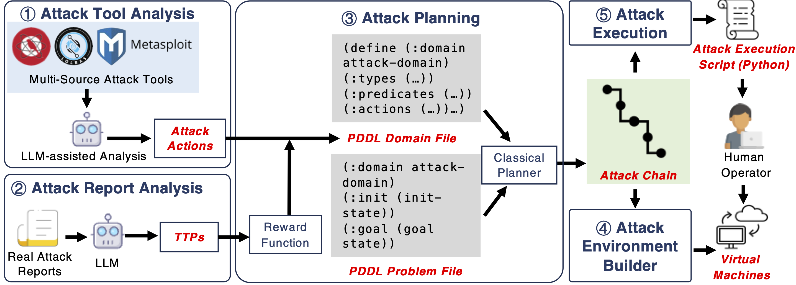
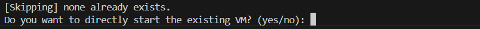
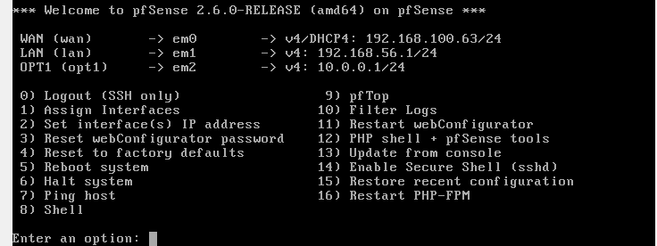

[](https:%5B%5D)

# Aurora-demos:

This project contains the attack chains generated by Aurora, a cyberattack emulation system leveraging classical planning (PDDL) and Large Language Models (LLMs).

Aurora is a framework that can automatically construct multi-step cyberattacks (attack chains), set up emulation environments, and semi-automatically execute the generated attack chains. With the help of LLM, it makes use of external attack tools and threat intelligence reports.

We are preparing publishing the source code of Aurora.

## 🎉 Introduction

<p><a href="https://arxiv.org/pdf/2407.16928"></a></p>

-   Introduces AURORA, an cyberattack emulation system leveraging classical planning (PDDL) and Large Language Models (LLMs).
-   Automates construction of a 5,000+ action attack space with over 1,000 chains.
-   AURORA generates higher quality attack plans with broader TTP coverage.

Our paper: [From Sands to Mansions: Towards Automated Cyberattack Emulation with Classical Planning and Large Language Models](https://arxiv.org/pdf/2407.16928)

## Resources & Socials

-   📜 [Documentation, training, and use-cases]()(Coming Soon)
-   ✍️ [aurora's blog]()(Coming Soon)
-   🌐 [Homepage](https://auroraattack.github.io/)

## System Overview

<p align="center">



</p>

## Attack Demos

This repo stores attack chains generated by Aurora, which can be found in the `examples/` folder. Each folder in `examples/` contains an attach chain, which includes the emulation plan details and attack steps.

For more details, please refer to the [introduction to attack chains](https://github.com/LexusWang/Aurora-demos/blob/main/docs/attack_chain_introduction.md).

## Usage
### 0. Dependencies
To execute the attack scripts, you need to configure an attack machine that contains the necessary attack tools used.
Specifically, we use [Attack Executor](https://github.com/LexusWang/attack_executor) to execute the attack actions provided by different attack tools.

Detailed configuration steps are documented in [GUIDE](./docs/attacker_environment_setup_guide.md).Follow the guide to prepare your Kali environment for attack script execution.
But no worries—we’ve also got a pre-configured Kali attack machine ready for you! You can download it directly from [here](https://www.baidu.com)

### 1. Pull and deploy the attack emulation environments:

Use the generated attack chain YML file and run pull.py to automatically download and deploy the corresponding virtual machine environment (works with VirtualBox; VMware users can manually deploy the downloaded files).

Two download modes are supported:

No duplicate downloads: If the file already exists, it will prompt whether to directly proceed with deployment.

Allow duplicate downloads: Files will be automatically renamed to avoid conflicts.

During initial deployment (including repeated deployments), the VM will not start automatically, allowing users to modify configurations.

By default, two network adapters will be configured: one in NAT mode and the other in Host-only mode. Make sure the required network is configured in VirtualBox; otherwise, the VM may fail to start.

``` bash
## Prohibiting duplicate deployment
python pull.py -p #yml_file_path -d #storage_path -vm #VBoxManage.exe_path --url_table #url_table_path -nr -firewall #yes/no
## Allowing duplicate downloads
python pull.py -p #yml_file_path -d #storage_path -vm #VBoxManage.exe_path --url_table #url_table_path -r -firewall #yes/no
```
- `yml_file_path`：The path of the attack chain yml file  
- `storage_path`：The storage path of the downloaded target machine file  
- `VBoxManage.exe_path`：The VBoxManage.exe path of VirtualBox is used for invocation  
- `url_table_path`：The path of the Download Link mapping table (url_table.csv)  
- `-nr`：Prohibiting duplicate deployment  
- `-r`：Allowing duplicate downloads  
- `-firewall`：Use pfSense firewall to isolate the attack aircraft and the target aircraft  


Example:If you don't want to allow repeated downloads of the attack chain "examples\access_encrypted_edge_credentials\attack_plan.yml" corresponding to the range. You can use 
``` bash
python pull.py -p examples\access_encrypted_edge_credentials\attack_plan.yml -d download -vm C:\\Program Files\\Oracle\\VirtualBox\\VBoxManage.exe --url_table docs\url_table.csv -nr -firewall no
```
If the download folder has already downloaded the corresponding shooting range, it will display:<p align="center">



</p>
Entering "yes" will directly start the corresponding virtual machine of the range.

On the contrary, if repetition is allowed, the downloaded file will be automatically renamed to avoid conflicts.

Besides, if you want to use firewall for isolation. You can use 
``` bash
python pull.py -p examples\access_encrypted_edge_credentials\attack_plan.yml -d download -vm C:\\Program Files\\Oracle\\VirtualBox\\VBoxManage.exe --url_table docs\url_table.csv -nr -firewall yes
```
If it was not downloaded originally, firewall.ova will be automatically downloaded. If there is already a download, it will skip and ask if you want to start it.

When using pfsense, attention should be paid to the configuration. The configuration of the downloaded and deployed pfsense is as follows:
<p align="center">



</p>
Therefore, two corresponding host-only network cards need to be set up in VirtualBox in advance. Meanwhile, it is recommended to turn off the NAT network card.


Special virtual machine download：In addition to the target machine information that can attack the chain file reading, we have also prepared an attack machine (Parrot) virtual machine, as well as an Ubuntu and MacOS target machine. To download these three virtual machines, you just need to enter in -p. 

For example:
``` bash
python pull.py -p attacker/Ubuntu/macos -d download -vm C:\\Program Files\\Oracle\\VirtualBox\\VBoxManage.exe --url_table docs\url_table.csv -nr
```

#### Attack emulation infrastructure

<p align="center">


</p>

Attackers: Kali,Windows 10<br> DNS_server: Debian<br> Firewall: pfSense<br> Victims：Windows 10,macOS,Ubuntu<br>

You can visit this [page](https://auroraattack.github.io) to view more detailed information about executing the attack chain using the simulation environment, or you can directly download the attack simulation environment from [here](https://drive.google.com/file/d/1cx-xcn10rDQaoq1SC9CW__0tbZVA5rEo/view?usp=sharing).

### 2. Generate attack scripts:

The logic of the script is to configure itself based on the `executor` provided in the `attack_plan.yml`. The script reads `command` and `arguments` by determining the type of `executor` specified. Additionally, it explicitly extracts `arguments` marked as `Required: true` from the `exploit` and `payload` sections of the file and outputs them directly into the executable script. This design simplifies user configuration and minimizes manual intervention. After executing this script, users will obtain a large number of ready-to-run attack scripts, streamlining the setup process and saving operational time

``` bash
python generateExecution.py
```

<p align="center">


</p>

### 3. Execute attack scripts:


```bash
python ../results/execution_xxxx.py
```
Click the following headings for details:
<details>
<summary>EXAMPLE-1_execution_keyboard_input_simulated-3</summary>

This attack plan uses `Metasploit` and `Sliver` tools to compromise Windows systems. First, a listener is established to capture incoming connections. A malicious `Sliver` payload is then created and delivered by tricking the victim into downloading/running it, granting remote access. Finally, this access is leveraged to deploy a stealthy `Meterpreter` payload via `Sliver` for data exfiltration (`keyboard input simulation`)


</details>

<details>
<summary>EXAMPLE-2_execution_file_info_known-1</summary>

This attack simulation targets Windows systems using `Sliver` and `Metasploit`. It starts by creating a `Sliver` implant (malicious.exe) and tricking the victim into downloading/running it as Administrator. This grants attackers an elevated `Sliver` C2 session. Next, a `Metasploit` listener is set up to catch a reverse HTTPS payload ("meterpreter_reverse_http") deployed through `Sliver`, enabling a stealthy `Meterpreter` session. Finally, attackers use `Meterpreter` to search for sensitive files (like *.txt) on compromised machines.


</details>

## Licensing

To discuss licensing opportunities, please reach out to aurora\@\[\] or directly to [ ](https:).
